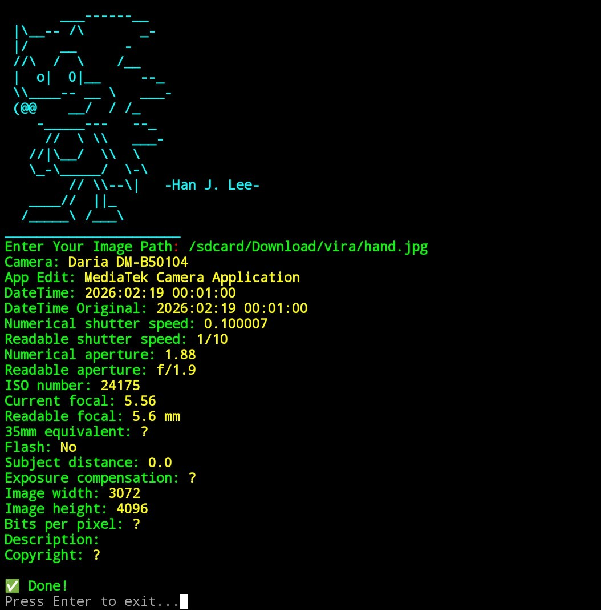

# MetaExif
MetaExif Tool: Extract camera settings, GPS data, and image metadata from JPEG photos - built with Byte Language 📸

# ScreenShot

# Download Byte
<a href="https://github.com/hellobytecodes/Language_Byte">Download Language Byte</a>

Before you know how to run the tool, please install it by clicking the link above and downloading the Byte language source.
